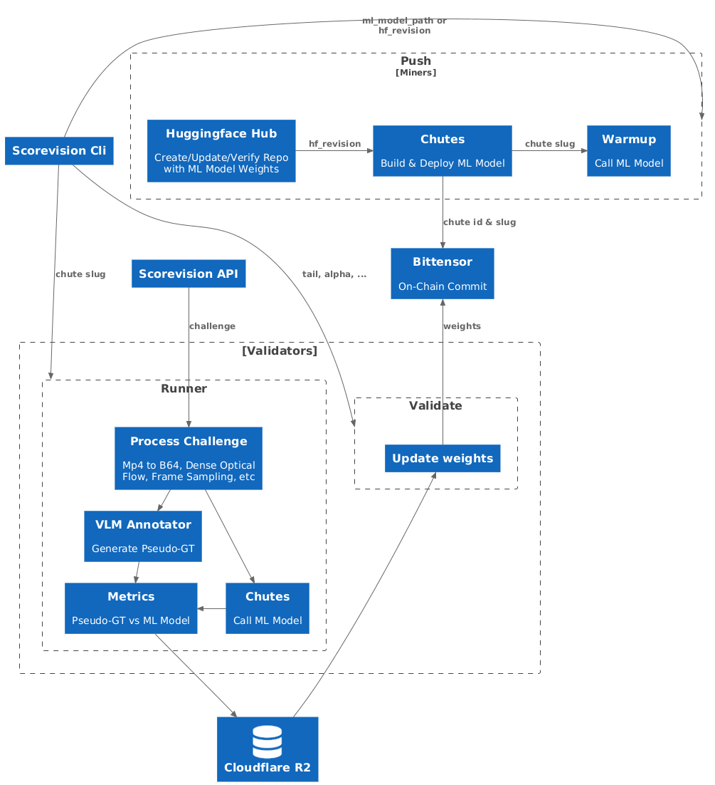

# TurboVision 

Turbo Vision is Score's decentralized intelligence layer for live video and imagery. The network pairs expert models with a global community of validators and miners so raw footage becomes structured, decision-ready data in real time, with our first deployments concentrated in professional sports. 

## Why Score built Turbo Vision

- Turbo Vision adapts to any high-volume visual stream—sports broadcasts, CCTV, aerial feeds, and more—so organizations can act on live signals instead of static reports. 
- Traditional pipelines are slow and costly; generic foundation models are too expensive to run continuously. Turbo Vision closes the gap with specialist, fast models that run at scale.
- A decentralized network accelerates learning. Validators stress-test outputs on fresh datasets while miners ship new models, letting Score improve accuracy and smoothness with every challenge.
- Early focus on elite football helps us stress-test the system against one of the most complex environments, setting the benchmark for other sports and industries.

## Participate 

- Validators keep the network honest by scoring submitted models on live data. Read the step-by-step playbook in [VALIDATOR.md](VALIDATOR.md).
- Miners contribute models that understand the game and respond to validator challenges. Follow the build-and-deploy loop in [MINER.md](MINER.md).

## Community & Support

- [Score Website](https://wearescore.com)
- File issues or ideas in this repo.

## Common Setup Prerequisites

These steps apply to both validators and miners. Complete them before diving into the role-specific guides above.

### Bittensor Wallet

Install the CLI, create a coldkey and hotkey, then copy the hotkey folder and public coldkey (`coldkeypub.txt`) onto every host that will run Turbo Vision.

```bash
pip install bittensor-cli
btcli wallet new_coldkey --n_words 24 --wallet.name my-wallet
btcli wallet new_hotkey --wallet.name my-wallet --n_words 24 --wallet.hotkey my-hotkey
cp env.example .env
```

Populate your `.env` with the shared secrets:

- `BITTENSOR_WALLET_COLD`
- `BITTENSOR_WALLET_HOT`
- `CHUTES_API_KEY`
- `HF_USER`
- `HF_TOKEN`

### Chutes Access

Upgrade to a developer-enabled account on [chutes.ai](https://chutes.ai), install the CLI, register, and mint an API key. Store the token in `.env` as `CHUTES_API_KEY`.

```bash
pip install -U chutes
chutes register
```

### Hugging Face Credentials

Create (or reuse) a Hugging Face account, generate a token with write access, and set `HF_USER` and `HF_TOKEN` in `.env`.

## ScoreVision CLI

Install the CLI with `uv`, then sync dependencies and verify the binary:

```bash
curl -LsSf https://astral.sh/uv/install.sh | sh
uv venv && source .venv/bin/activate
uv sync
sv
```

Once these prerequisites are set, jump into your role guide to finish configuration and start contributing to Turbo Vision.


