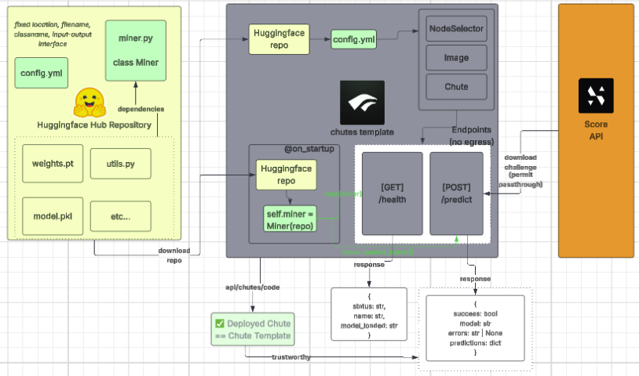

# 🚀 Example Chute for Turbovision 🪂

This repository demonstrates how to deploy a **Chute** via the **Turbovision CLI**, hosted on **Hugging Face Hub**.
It serves as a minimal example showcasing the required structure and workflow for integrating machine learning models, preprocessing, and orchestration into a reproducible Chute environment.

## Repository Structure 
The following two files **must be present** (in their current locations) for a successful deployment — their content can be modified as needed:

| File | Purpose |
|------|----------|
| `miner.py` | Defines the ML model type(s), orchestration, and all pre/postprocessing logic. |
| `config.yml` | Specifies machine configuration (e.g., GPU type, memory, environment variables). |

Other files — e.g., model weights, utility scripts, or dependencies — are **optional** and can be included as needed for your model. Note: Any required assets must be defined or contained **within this repo**, which is fully open-source, since all network-related operations (downloading challenge data, weights, etc.) are disabled **inside the Chute** 

## Overview

Below is a high-level diagram showing the interaction between Huggingface, Chutes and Turbovision:



## Local Testing
After editing the `config.yml` and `miner.py` and saving it into your Huggingface Repo, you will want to test it works locally. 

1. Copy the file `scorevision/chute_tmeplate/turbovision_chute.py.j2` as a python file called `my_chute.py` and fill in the missing variables:
```python
HF_REPO_NAME = "{{ huggingface_repository_name }}"
HF_REPO_REVISION = "{{ huggingface_repository_revision }}"
CHUTES_USERNAME = "{{ chute_username }}"
CHUTE_NAME = "{{ chute_name }}"
```

2. Run the following command to build the chute locally (Caution: there are known issues with the docker location when running this on a mac) 
```bash
chutes build my_chute:chute --local --public
```

3. Run the name of the docker image just built (i.e. `CHUTE_NAME`) and enter it
```bash
docker run -p 8000:8000 -e CHUTES_EXECUTION_CONTEXT=REMOTE -it <image-name> /bin/bash
```

4. Run the file from within the container
```bash
chutes run my_chute:chute --dev --debug
```

5. In another terminal, test the local endpoints to ensure there are no bugs
```bash
curl -X POST http://localhost:8000/health -d '{}'
curl -X POST http://localhost:8000/predict -d '{"url": "https://scoredata.me/2025_03_14/35ae7a/h1_0f2ca0.mp4","meta": {}}'
```

## Live Testing
1. If you have any chute with the same name (ie from a previous deployment), ensure you delete that first (or you will get an error when trying to build).
```bash
chutes chutes list
```
Take note of the chute id that you wish to delete (if any)
```bash
chutes chutes delete <chute-id>
```

You should also delete its associated image 
```bash
chutes images list
```
Take note of the chute image id
```bash
chutes images delete <chute-image-id>
```

2. Use Turbovision's CLI to build, deploy and commit on-chain (Note: you can skip the on-chain commit using `--no-commit`.  You can also specify a past huggingface revision to point to using `--revision` and/or the local files you want to upload to your huggingface repo using `--model-path`)
```bash
sv -vv push
```

3. When completed, warm up the chute (if its cold 🧊). (You can confirm its status using `chutes chutes list` or `chutes chutes get <chute-id>` if you already know its id). Note: Warming up can sometimes take a while but if the chute runs without errors (should be if you've tested locally first) and there are sufficient nodes (i.e. machines) available matching the `config.yml` you specified, the chute should become hot 🔥!
```bash
chutes warmup <chute-id>
```

4. Test the chute's endpoints
```bash
curl -X POST https://<YOUR-CHUTE-SLUG>.chutes.ai/health -d '{}' -H "Authorization: Bearer $CHUTES_API_KEY"
curl -X POST https://<YOUR-CHUTE-SLUG>.chutes.ai/predict -d '{"url": "https://scoredata.me/2025_03_14/35ae7a/h1_0f2ca0.mp4","meta": {}}' -H "Authorization: Bearer $CHUTES_API_KEY"
```

5. Test what your chute would get on a validator (this also applies any validation/integrity checks which may fail if you did not use the Turbovision CLI above to deploy the chute)
```bash
sv -vv run-once
```